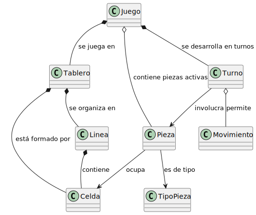

<div align=center>

|Observar||Conceptualizar||Decidir||Construir||Ejecutar|
|:-:|:-:|:-:|:-:|:-:|:-:|:-:|:-:|:-:|
|[***Modelo del dominio***](/docs/modeloDelDominio.md)|>>|[Requisitos](/docs/ProcesoRequisitos.md)|>>|[Análisis](/docs/ProcesoAnalisis.md)|>>|[Decisiones tecnológicas](/docs/DecisionesTecnologicas.md)|>>|[Diseño](/docs/ProcesoDiseño.md)|>>|[Código](/src/)

</div>

# Modelo del dominio

El **modelo del dominio** es la fase donde capturamos los **conceptos puros del mundo real**, sin contaminación tecnológica. Aquí identificamos entidades, relaciones, vocabulario y reglas.

## Metodología seguida

### 1. Comprensión del dominio: inmersión en Tetris

**Actividades realizadas:**

- Jugar varias partidas de Tetris
- Leer las reglas oficiales del juego
- Observar a otros jugadores
- Identificar vocabulario común

**Pregunta clave:** *¿Qué conceptos usa naturalmente alguien cuando explica el Tetris?*

**Primeras observaciones:**

> "Las **piezas** caen por el **tablero**"  
> "Cuando completas una **línea**, desaparece"  
> "Cada **turno** mueves la **pieza** actual"  
> "Hay diferentes **tipos de piezas**: la I, la O, la T..."  
> "El **juego** termina cuando no caben más piezas"

### 2. Identificación inicial de conceptos (brainstorming)

**Técnica:** Identificación de sustantivos en descripciones del juego

<div align=center>

|Sustantivos identificados|Fuente|
|-|-|
|Juego|"Iniciar un nuevo **juego**"|
|Partida|"**Partida** en curso"|
|Tablero|"**Tablero** de 10x20"|
|Pieza|"**Pieza** que cae"|
|Tetrimino|Nombre técnico de las **piezas**|
|Bloque|Unidad mínima de una pieza|
|Celda|Espacio en el tablero|
|Línea|Fila horizontal completa|
|Columna|Fila vertical|
|Puntuación|Puntos acumulados|
|Nivel|Dificultad actual|
|Velocidad|Rapidez de caída|
|Jugador|Quien controla las piezas|
|Movimiento|Acción sobre una pieza|
|Rotación|Tipo de movimiento|
|Caída|Movimiento vertical|
|Turno|Ciclo de juego|

</div>

### 3. Primera depuración: consolidación de sinónimos

**Decisiones de unificación:**

<div align=center>

|Conceptos similares|Decisión|Justificación|
|-|-|-|
|Juego vs Partida|→ **Juego**|"Partida" es más específico para juegos multijugador|
|Pieza vs Tetrómino|→ **Pieza**|"Pieza" es más natural en español|
|Bloque vs Celda ocupada|→ Parte de **Pieza**|Los bloques no existen independientemente|
|Rotación/Caída/Desplazamiento|→ **Movimiento**|Son variantes del mismo concepto|

</div>

### 4. Análisis de responsabilidades: verbos

**Técnica:** Identificación de verbos asociados a cada concepto

<div align=center>

|Concepto|Verbos asociados|¿Es entidad del dominio?|
|-|-|:-:|
|Juego|Iniciar, terminar, pausar, mantener puntuación|Sí|
|Tablero|Contener piezas, validar posiciones, eliminar líneas|Sí|
|Pieza|Caer, moverse, rotar, colocarse|Sí|
|Línea|Completarse, eliminarse, contar puntos|Sí|
|Celda|Estar ocupada/vacía|Sí|
|Movimiento|Ejecutarse, validarse|Sí|
|Turno|Comenzar, finalizar|Sí|
|Puntuación|Incrementarse, mostrarse|Hay dudas|
|Nivel|Aumentar, determinar velocidad|Hay dudas|
|Jugador|Controlar, decidir|Hay dudas|

</div>

### 5. Identificación de relaciones naturales

**Pregunta:** *¿Cómo se relacionan estos conceptos en el mundo real?*

**Relaciones evidentes:**

- "El **juego** se juega en un **tablero**"
- "El **tablero** está formado por **celdas**"
- "Las **piezas** ocupan **celdas**"
- "Una **línea** contiene **celdas**"
- "Cada **turno** involucra una **pieza**"
- "Un **turno** permite **movimientos**"

### 6. Decisiones críticas de modelado

#### ¿Incluir "Jugador"?

**Análisis:**

- **A favor:** Es quien toma las decisiones
- **En contra:** En Tetris single-player es implícito

> **Decisión: excluir** - El sistema no necesita modelar múltiples jugadores

#### ¿"Puntuación" y "Nivel" como entidades?

**Análisis:**

- **A favor:** Son conceptos que los jugadores mencionan
- **En contra:** Son atributos simples del juego

> **Decisión: excluir como entidades** - Son propiedades de Juego

#### ¿"TipoPieza" o formas dentro de "Pieza"?

**Análisis:**

- **A favor de TipoPieza:** Hay exactamente 7 tipos bien definidos
- **En contra:** Podría ser solo datos de Pieza

> **Decisión: incluir TipoPieza** - Es un concepto del dominio que los jugadores reconocen

### 7. Refinamiento de relaciones

**Análisis de multiplicidades y tipos:**

<div align=center>

|Relación|Tipo|Justificación|
|-|-|-|
|Juego - Tablero|Composición 1:1|Un juego tiene exactamente un tablero que no existe sin él|
|Juego - Pieza (activas)|Agregación 1:*|El juego gestiona piezas, pero estas pueden existir conceptualmente sin un juego|
|Tablero - Celda|Composición 1:*|Las celdas son parte integral del tablero|
|Tablero - Línea|Composición 1:*|Las líneas son agrupaciones lógicas de celdas del tablero|
|Pieza - TipoPieza|Asociación *:1|Cada pieza es de un tipo específico|
|Línea - Celda|Composición 1:*|Una línea es un conjunto específico de celdas|

</div>

### 8. Modelo del dominio resultante

<div align=center>

|
|-

</div>

### 9. Validación con expertos del dominio

**Preguntas de validación:**

<div align=center>

|||
|-|-|
¿Un jugador de Tetris reconoce todos estos conceptos?|**Sí** - Son términos naturales del juego
¿Las relaciones reflejan cómo se entiende el juego?|**Sí** - "El juego tiene un tablero", "las piezas caen", etc.
¿Falta algún concepto esencial?|**No** - Los conceptos cubren la mecánica completa
¿Hay conceptos que sobran?|**No** - Todos son mencionados naturalmente al explicar el juego

</div>

## Conceptos considerados y descartados

### Descartados en el proceso

<div align=center>

|Concepto|Razón para descartarlo|
|-|-|
|**Jugador**|Implícito en versión single-player|
|**Bloque**|Abstracción innecesaria - parte de Pieza|
|**Columna**|No tiene comportamiento propio en Tetris|
|**Velocidad**|Atributo de Juego, no entidad|
|**Preview/Siguiente**|Detalle de interfaz, no del dominio puro|
|**Sombra/Ghost**|Feature de UI, no concepto del dominio|
|**Estadísticas**|Fuera del núcleo del dominio|

</div>

### Simplificaciones conscientes

<div align=center>

|Simplificación|Justificación|
|-|-|
|Sin niveles de dificultad|Mantener el modelo esencial|
|Sin power-ups o piezas especiales|Tetris clásico|
|Sin multijugador|Complejidad innecesaria para el ejemplo|

</div>

## Evolución del modelo

### Versión 0: Lista plana

```
Juego, Tablero, Pieza, Celda, Línea, Puntuación, 
Jugador, Movimiento, Nivel, Velocidad, Turno...
```

### Versión 1: Primeras relaciones

```
Juego contiene → Tablero, Piezas, Puntuación
Tablero contiene → Celdas, Líneas
Pieza ocupa → Celdas
```

### Versión 2: Refinamiento

- Se elimina Jugador (implícito)
- Se agregan TipoPieza y Turno
- Se refinan multiplicidades

### Versión 3: Modelo final

- Relaciones claramente tipadas
- Conceptos del dominio puro
- Validado contra el vocabulario natural

## Lecciones del proceso

### Lo que funcionó bien

1. **Empezar con el vocabulario natural**
   - Los jugadores ya tienen un modelo mental
   - Evita sobre-ingeniería temprana

2. **Distinguir dominio de solución**
   - "Preview" es UI, no dominio
   - "Array" es implementación, no dominio

3. **Validar constantemente**
   - ¿Lo explicaría así un jugador?
   - ¿Es necesario para entender el juego?

### Dificultades encontradas

1. **Tentación de incluir detalles técnicos**
   - "Matriz de rotación" → No es dominio
   - "Buffer de entrada" → No es dominio

2. **Decidir nivel de granularidad**
   - ¿Celda o simplemente posición?
   - ¿Bloque individual o solo Pieza completa?

3. **Resistir features avanzadas**
   - Hold piece, T-spins, wall kicks
   - Importantes en Tetris moderno, pero complican el modelo

## Conclusión

El modelo del dominio resultante captura la **esencia del Tetris** sin contaminación tecnológica:

1. **Es comprensible** para cualquier jugador
2. **Es completo** para las mecánicas básicas
3. **Es neutral** respecto a la implementación
4. **Es extensible** para features futuras

**Decisión clave:** Mantener el modelo simple y fiel al vocabulario natural del dominio, resistiendo la tentación de adelantar decisiones de diseño o implementación.

## ¿Y ahora qué?

Este modelo del dominio sirve como **contrato conceptual** para el resto del desarrollo:

1. **Para el [análisis](ProcesoAnalisis.md):** ¿Qué conceptos se convierten en clases?
2. **Para el [diseño](ProcesoDiseño.md):** ¿Cómo se implementan estas relaciones?
3. **Para la validación:** ¿El código final respeta estos conceptos?

El siguiente paso es transformar estos conceptos puros del dominio en elementos de software durante la fase de análisis, manteniendo la trazabilidad desde el vocabulario del jugador hasta el código ejecutable.
